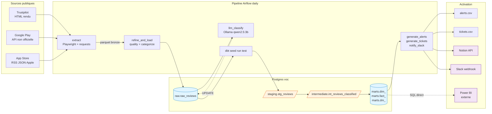
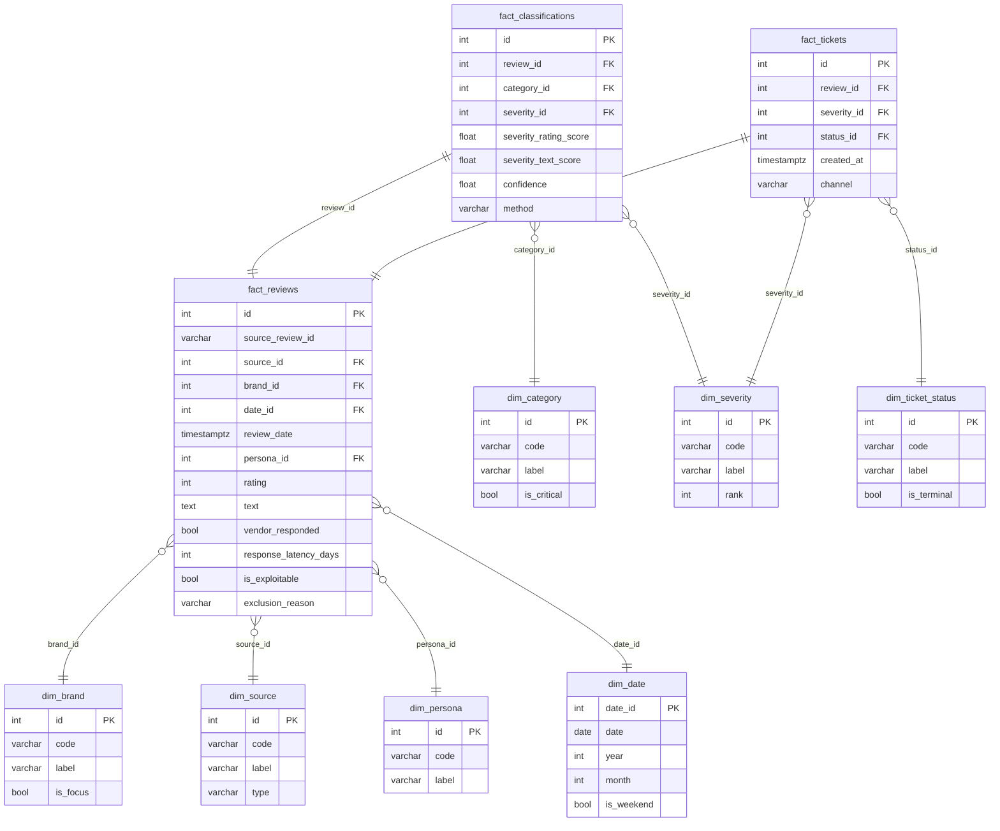
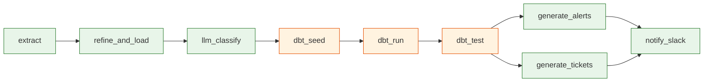
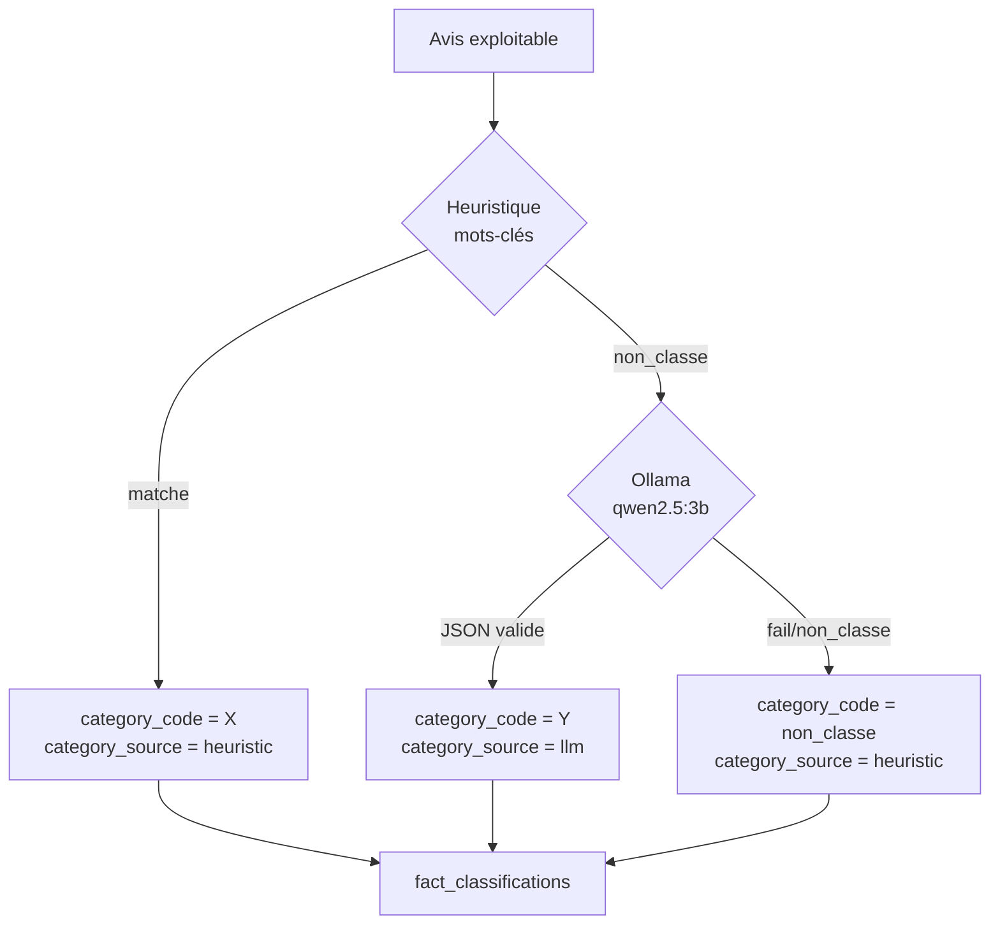
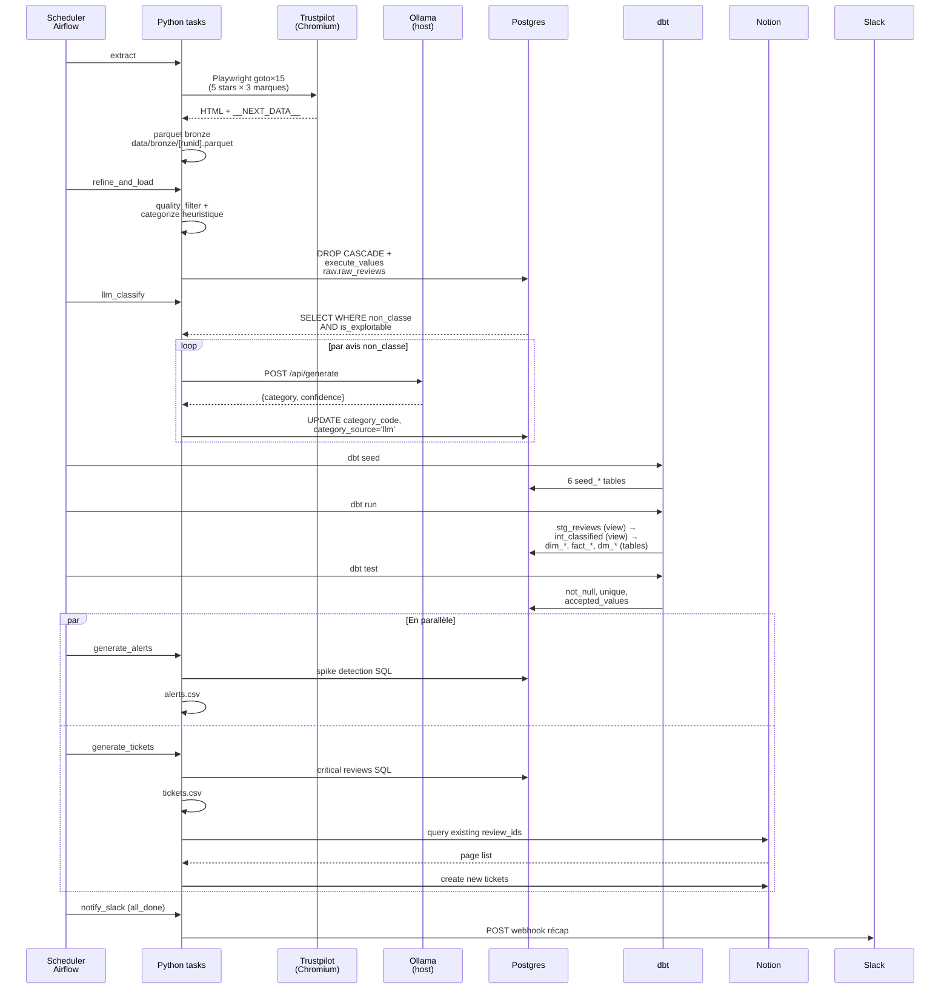

# Architecture — Voice of Customer MVP

> Documentation technique du MVP : flux de données, modèle dimensionnel,
> composants, choix techniques justifiés et frontières à respecter.

---

## 1. Vue d'ensemble



**Philosophie** : pipeline data engineering classique (medallion lite) avec
catégorisation hybride heuristique → LLM, exposant un star schema interrogé
par une couche BI **externe** (pas d'outil de visualisation embarqué dans le
compose principal).

---

## 2. Pipeline en 3 phases

### Phase 1 — Collecte & Raffinement

| Étape | Module | Rôle |
|---|---|---|
| Scraping | `src/voc/ingestion/{google_play,app_store,trustpilot}.py` | 3 scrapers Python, capés à 100 avis × 3 marques × 3 sources = 900 avis max/run. Trustpilot via Playwright (Chromium headless) pour bypass AWS WAF. |
| Sérialisation | `src/voc/ingestion/runner.py` | Concat + dédup `(source_code, source_review_id)`, écrit `data/bronze/raw_reviews_<runid>.parquet`. |
| Quality filter | `src/voc/refinement/quality_filter.py` | 5 motifs d'exclusion (vide, placeholder, trop court, non-textuel, générique). Sortie : `is_exploitable`, `exclusion_reason`. |
| Catégorisation heuristique | `src/voc/refinement/categorize.py` | Mots-clés FR/EN normalisés (NFD), gestion de la négation. 8 catégories alignées sur les seeds dbt. |
| Sévérité | `src/voc/refinement/categorize.py` | 3 niveaux (low/medium/high). Règles dérogatoires : note=1 ⇒ high, note=2 + catégorie critique ⇒ high. |
| Persona | `src/voc/refinement/categorize.py` | locataire / propriétaire / indéterminé via patterns "je suis hôte", "mes annonces"… |
| Chargement | `src/voc/warehouse/loader.py` | `psycopg2 + execute_values` → `voc.raw.raw_reviews`. DROP CASCADE pour relancer (les views dbt en dépendent). |

### Phase 1b — Reclassification LLM (best-effort)

| Étape | Module | Rôle |
|---|---|---|
| LLM fallback | `src/voc/refinement/llm_classify.py` | Sur les avis `is_exploitable=TRUE AND category_code='non_classe'`, appelle Ollama (`qwen2.5:3b` par défaut), parse le JSON `{category, confidence}`, valide vs `VALID_CATEGORIES`, UPDATE `category_code` + `category_source='llm'`. |

Étape **non-bloquante** : si Ollama est down, le DAG continue avec
`category_source='heuristic'` partout.

### Phase 2 — Data Warehouse (dbt + Postgres)

```
raw.raw_reviews          ← écrit par Python loader
     ↓ (view)
staging.stg_reviews      ← nettoyage, dédup ROW_NUMBER, calculs latence
     ↓ (view)
intermediate.int_reviews_classified  ← jointures FK seeds
     ↓ (tables)
marts.dim_*              ← dimensions
marts.fact_*             ← faits
marts.dm_*               ← data marts métier
```

dbt-postgres adapter, 1 modèle `view` par étage staging/intermediate, modèles `table`
matérialisés pour marts (full rebuild à chaque `dbt run`).

### Phase 3 — Activation métier

| Tâche Airflow | Module | Sortie |
|---|---|---|
| `generate_alerts` | `src/voc/activation/alerting.py` | `data/alerts.csv` — détection de pic 7j vs baseline 4 sem (≥ 5 avis high ET ≥ 2× la baseline). |
| `generate_tickets` | `src/voc/activation/ticketing.py` | `data/tickets.csv` (audit) + Notion API si tokens configurés. Idempotent par `review_id`. |
| `notify_slack` | `src/voc/activation/slack.py` | Webhook Slack, 1 message récap par run. Skip silencieux si rien à signaler. |

---

## 3. Modèle de données

### 3.1 Star schema



### 3.2 Data marts métier

Chaque mart cible une audience et matérialise une vue dénormalisée prête à
brancher sur Power BI (1 dashboard ↔ 1 mart) :

| Mart | Audience | Granularité | KPIs |
|---|---|---|---|
| `dm_direction_synthese` | CODIR | (date × marque) | total_reviews, avg_rating, share_critical, ticket_resolution_rate, **gap_vs_competitors** |
| `dm_marketing_voc` | Marketing | (date × marque × catégorie × persona) | review_count, avg_rating, share_high_severity, ratio_vs_abritel |
| `dm_finance_litiges` | Finance | 1 ligne / avis financier | rating, vendor_responded, response_latency_days, severity_label |
| `dm_sav_tickets` | SAV | 1 ligne / ticket | days_open, status_label, assignee, brand × source × catégorie |

### 3.3 Catégories métier (alignées seeds dbt)

| Code | Label | `is_critical` | Owner team (ticketing) |
|---|---|---|---|
| `app_fr` | Localisation / Langue | non | produit |
| `transparence_financiere` | Transparence financière | **oui** | finance |
| `fiabilite_reservations` | Fiabilité réservations | **oui** | sav |
| `service_client` | Service client | **oui** | sav |
| `qualite_annonces` | Qualité des annonces | non | trust_safety |
| `parcours_paiement` | Parcours paiement | **oui** | finance |
| `communication_hote` | Communication hôte | non | sav |
| `non_classe` | Non classé | non | (pas de ticket) |

Un ticket est généré **uniquement si** `is_exploitable=TRUE AND severity='high' AND is_critical=TRUE`.

---

## 4. Composants techniques

### 4.1 Orchestration — Airflow 2.10

DAG unique `voc_pipeline` (`@daily`), tâches in-process via `PythonOperator`
(les tâches Python partagent la même DuckDB postgres connection sans IPC).



`notify_slack` a `trigger_rule=all_done` : il s'exécute même si une tâche
amont a échoué (utile pour notifier les incidents).

### 4.2 Transformations — dbt 1.8 + Postgres

- **Profile** : `dbt/profiles.yml` lit les env vars `VOC_PG_*` (mêmes que le loader Python).
- **Macro override** : `dbt/macros/generate_schema_name.sql` désactive le préfixe `<target>_<schema>` de dbt, pour que `+schema: marts` produise littéralement `marts.*` (sinon les requêtes Python dans `voc.activation.*` cassent).
- **Tests dbt** : `not_null`, `unique`, `accepted_values` sur les colonnes critiques (cf. `sources.yml` et `_core.yml`).

### 4.3 Scraping — Python + Playwright

- **Google Play** : `google-play-scraper` (lib pip), pagination par batches de 200, sort=newest, lang=fr.
- **App Store** : RSS JSON Apple (`itunes.apple.com/.../json`), pagination 1→3.
- **Trustpilot** : Playwright Chromium headless (UA Chrome récent + locale fr-FR), `wait_until=networkidle`, extraction du JSON `__NEXT_DATA__`. Fallback `requests` (souvent bloqué par AWS WAF) pour la CI ou les environnements sans browser.
- **Cap dur** : `VOC_MAX_REVIEWS_PER_SOURCE=100` par couple (source × marque).
- **Fenêtre** : `VOC_SCRAPE_WINDOW_DAYS=30` (date filter inclusive).

### 4.4 Catégorisation hybride

Stratégie en 2 passes pour combiner déterminisme et flexibilité :



Avantages :
- **Déterminisme** sur les cas évidents (mots-clés matchent en 99 % des avis avec un signal clair).
- **Flexibilité** sur les cas ambigus (LLM peut comprendre paraphrases, métaphores).
- **Économie d'appels LLM** (~30-50 % des avis seulement, pas tous).
- **Audit** : `fact_classifications.method` indique l'origine, permet de mesurer la valeur ajoutée du LLM.

### 4.5 Activation externe

| Service | Rôle | Activation |
|---|---|---|
| **Notion** | Backlog de tickets en kanban (open → in_progress → done) | `NOTION_TOKEN` + `NOTION_DATABASE_ID` dans `.env` |
| **Slack** | Notification récap fin de run | `SLACK_WEBHOOK_URL` dans `.env` |
| **Power BI** (externe) | Dashboards métier | Connexion directe à Postgres `localhost:5433` |
| **Ollama** | LLM local | `OLLAMA_BASE_URL` + `OLLAMA_MODEL` dans `.env` (par défaut Mac hôte via `host.docker.internal:11434`) |

Toutes les intégrations sont **opt-in** : tokens vides = skip silencieux, le DAG ne casse pas.

---

## 5. Choix techniques justifiés

| Décision | Alternatives écartées | Justification |
|---|---|---|
| **Postgres** comme DWH | DuckDB (initial), Snowflake, BigQuery | Postgres déjà présent (metastore Airflow) → pas de service supplémentaire ; standard SQL pour Power BI ; dbt-postgres mature. DuckDB initial était fichier-only — pas connectable depuis Power BI sans driver ODBC. |
| **dbt** pour les transforms | SQL inline Python, Spark | Versioning Git natif, tests intégrés (`accepted_values`, `not_null`), graph de dépendances visualisable, modèles modulaires. Overkill ? Peut-être à 1k avis, mais standardise les patterns équipe. |
| **Airflow** pour l'orchestration | Cron + scripts, Prefect, Dagster | Standard data engineering, UI claire pour les non-devs, DAG en Python pur, retry/SLA gérés. Compose `LocalExecutor` (pas de Celery) → léger pour MVP. |
| **Playwright** pour Trustpilot | requests + headers réalistes, ScraperAPI (payant) | AWS WAF bloque les UA non-browser. Playwright est l'option la plus fiable, headless Chromium dans l'image Airflow (~500 MB de plus, acceptable). |
| **Ollama** pour LLM | OpenAI API, Anthropic API, HuggingFace | **Local + gratuit + privé** (RGPD : aucun avis ne sort de l'infra). `qwen2.5:3b` choisi pour son ratio qualité/taille (1.9 GB) et sa gestion correcte du français. |
| **Catégorisation hybride** (heuristique → LLM) | LLM only, mots-clés only | Mots-clés seuls : ~50 % `non_classe` (rate trop élevé). LLM only : 9× plus d'appels (lent + non-déterministe pour cas évidents). Hybride : ~10-15 % de `non_classe` finale, audit trail conservé. |
| **Notion** pour le ticketing | Linear, Jira, GitHub Issues | API simple, gratuit pour le MVP, UI familière des équipes non-tech. Idempotence par `review_id` (pas de doublons à chaque run). |
| **BI externe (Power BI)** | Grafana embarqué, Superset embarqué | Power BI = standard entreprise, licences déjà en place chez Abritel. Branches `dashboards-grafana` et `dashboards-superset` disponibles si on veut pivoter. |
| **Postgres mappé sur 5433** côté hôte | Port 5432 standard | 5432 souvent occupé par un Postgres local du dev. |
| **Cap 100 avis/source/marque** | Pas de cap | Démo lisible, runs courts (~3 min total), assez pour valider la pipeline. Configurable via `VOC_MAX_REVIEWS_PER_SOURCE`. |

---

## 6. Flux de données détaillé (1 run du DAG)



---

## 7. Conventions critiques

### 7.1 Couplages à respecter (sinon le DAG casse silencieusement)

1. **Codes Python ↔ seeds dbt** : tout `category_code` retourné par
   `categorize.py` ou `llm_classify.py` doit exister dans
   `dbt/seeds/seed_categories.csv`. Sinon la jointure FK dans
   `intermediate.int_reviews_classified` échoue silencieusement (LEFT JOIN
   ⇒ NULL ⇒ test `not_null` casse).

2. **Colonnes raw ↔ contrat dbt** : `_RAW_COLUMNS` et `_CREATE_TABLE_SQL`
   dans `loader.py` doivent matcher `dbt/models/sources.yml` ET
   `dbt/models/staging/stg_reviews.sql`. Si on ajoute une colonne, mettre
   à jour les **3** endroits.

3. **Owner team mapping** : le `CASE category_code` dans `ticketing.py`
   doit couvrir toutes les catégories `is_critical=true`. Sinon les
   tickets concernés tombent dans le `ELSE 'sav'` par défaut.

4. **Macro `generate_schema_name`** : si on supprime/modifie cette macro,
   les schémas dbt deviennent `<target>_marts.*` au lieu de `marts.*` et
   toutes les requêtes Python dans `voc.activation.*` cassent.

### 7.2 Idempotence

- `raw.raw_reviews` : `DROP CASCADE` + `CREATE TABLE` à chaque run (CASCADE pour libérer les views dbt qui en dépendent).
- Marts : matérialisés en `table` (full rebuild à chaque `dbt run`).
- Notion : query par `review_id` avant create (skip si existe).
- Slack : pas d'état (1 message par run, comportement déterministe).

### 7.3 Catégorisation : ordre d'évaluation de la sévérité

`categorize.classify_severity(text, rating, category_code)` applique ces
règles dans cet ordre, **première règle qui matche court-circuite** :

1. ≥ 2 mots-clés gravité haute dans le texte (`arnaque`, `tribunal`, `inadmissible`…) → `high`
2. note = 1 → `high`
3. note = 2 ET catégorie ∈ {transparence_financiere, fiabilite_reservations, parcours_paiement} → `high`
4. note = 2 → `medium`
5. sinon → `low`

La normalisation NFD + accent-strip + lowercase est appliquée au texte
avant le matching. La regex `_NEGATION_RE` strip les négations type
"pas une arnaque" pour éviter les faux positifs.

---

## 8. Variantes (branches Git)

| Branche | Couche BI | Cas d'usage |
|---|---|---|
| **`main`** | Externe (Power BI direct sur Postgres) | Production, MVP final, intégration entreprise |
| `dashboards-grafana` | Grafana 11 + 3 dashboards JSON pré-construits (Executive Overview, Brand Comparison, Operations & SAV) | Démo "tout intégré" en `docker compose up`, dashboards versionnés en code |
| `dashboards-superset` | Apache Superset 4.1 + datasource auto + 4 datasets | Drag-and-drop pour métiers, look BI classique |
| `analyse-quanti` | (pas de pipeline DE) — notebook Jupyter monolithique | Archive R&D, analyses statistiques (Cohen's Kappa, Chi², bootstrap) |

---

## Annexe A — Variables d'environnement

| Variable | Défaut | Effet |
|---|---|---|
| `POSTGRES_USER` / `_PASSWORD` / `_DB` | `postgres` / `postgres` / `airflow` | Auth + DB metastore Airflow |
| `VOC_PG_DBNAME` | `voc` | DB du data warehouse |
| `VOC_PG_HOST` / `_PORT` | `postgres` / `5432` (depuis Docker) | Endpoints. Override pour dev local : `localhost` / `5433`. |
| `AIRFLOW_ADMIN_USER` / `_PASSWORD` | `airflow` / `airflow` | Login UI Airflow |
| `AIRFLOW_SECRET_KEY` | `CHANGE_ME_*` dans `.env.example` | Sessions Flask scheduler ↔ webserver (sinon 403 sur fetch logs) — à surcharger hors démo locale |
| `OLLAMA_BASE_URL` | `http://host.docker.internal:11434` | Ollama Mac hôte ; pour Docker : `http://ollama:11434` (profile `with-ollama`) |
| `OLLAMA_MODEL` | `qwen2.5:3b` | Modèle LLM |
| `OLLAMA_ENABLED` | `true` | `false` ou vide ⇒ skip étape LLM |
| `NOTION_TOKEN` / `NOTION_DATABASE_ID` | vide | Vide ⇒ ticketing désactivé (CSV uniquement) |
| `SLACK_WEBHOOK_URL` | vide | Vide ⇒ notif Slack désactivée |
| `VOC_MAX_REVIEWS_PER_SOURCE` | `100` | Cap dur sur le scraping ; `0` ⇒ pas de cap |
| `VOC_SCRAPE_WINDOW_DAYS` | `30` | Fenêtre glissante du scraping |

---

## Annexe B — Tests

`tests/` (43 tests, `pytest -q`) :

| Fichier | Cible |
|---|---|
| `test_quality_filter.py` | 7 motifs d'exclusion |
| `test_categorize.py` | 8 catégories + sévérité + persona + négations |
| `test_llm_classify.py` | Parsing réponses Ollama, mocks `psycopg2.connect` pour `refine_unclassified` |
| `test_notion.py` | Idempotence par `review_id`, gestion d'erreurs API |
| `test_slack.py` | Format message, skip silencieux, swallow exceptions HTTP |

**Tous les tests externes sont mockés** (`requests.post`, `psycopg2.connect`) — pas de hit réseau ni DB en CI.

---

## Annexe C — Limites assumées du MVP

- **LLM en fallback uniquement** (sur `non_classe`), pas de re-classification globale → risque de biais si l'heuristique se trompe.
- **Notion append-only** : le statut d'un ticket déjà créé n'est jamais re-synchronisé depuis le pipeline ; le cycle de vie se gère côté Notion.
- **Slack basique** : 1 message récap, pas de threading par catégorie.
- **Pas d'incrémentalité dbt** : full rebuild à chaque run (acceptable à ~1k avis ; passer en `incremental` pour scaler).
- **Trustpilot dépendant de Playwright** : si Trustpilot change le format `__NEXT_DATA__`, il faudra adapter le parser. Anti-bot AWS WAF peut aussi durcir le challenge.
- **Pas de monitoring de la qualité LLM** : on ne mesure pas la dérive entre les versions de `qwen2.5:3b` ni la distribution des `confidence` scores.
- **Pas de RBAC sur Postgres** : `postgres/postgres` superuser pour tout. À durcir avant prod.
